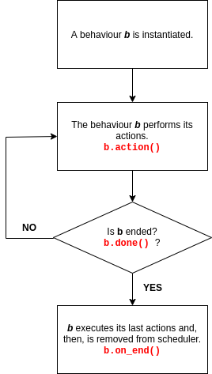

# Behaviours in PADE
##### PADE Update (LAAI | UFPA), released at 4-22-2019, updated at 5-27-2020


## Content
- [Introduction](#introduction)
- [Agent behaviours on PADE](#agent-behaviours-on-pade)
	- [OneShotBehaviour class](#oneshotbehaviour-class)
	- [WakeUpBehaviour](#wakeupbehaviour-class)
	- [SimpleBehaviour](#simplebehaviour-class)
	- [CyclicBehaviour](#cyclicbehaviour-class)
	- [TickerBehaviour](#tickerbehaviour-class)
	- [SequentialBehaviour](#sequentialbehaviour-class)
- [Mutual Exclusion with behaviours](#mutual-exclusion-with-behaviours)
- [Classes and methods](#classes-and-methods)
	- [SimpleBehaviour](#simplebehaviour)
	- [OneShotBehaviour class](#oneshotbehaviour)
 	- [CyclicBehaviour](#cyclicbehaviour)
	- [WakeUpBehaviour](#wakeupbehaviour)
	- [TickerBehaviour](#tickerbehaviour)
	- [SequentialBehaviour](#sequentialbehaviour)
- [Contact us](#contact-us)


## Introduction
This document aims to describe how PADE implements behaviours of agents. The way to implement behaviours in PADE is similar to the paradigm used in [JADE Framework](https://jade.tilab.com/). This is an update provide to PADE by [LAAI](http://www.laai.ufpa.br/). Although this update is incorporated in the code, the features of the previous version of PADE still work normally. We hope you enjoy this update.


## Agent Behaviours on PADE
In this session we will approach quickly the referred way to program behaviours in PADE. The used paradigm is based in [JADE](https://jade.tilab.com/) programming, so, if you want to know more about this agent-based programming style, see some examples with behaviours in JADE.

The first one thing to keep in mind while developing behaviours is that behaviours have two main methods to be implemented. They are: `action()` and `done()` methods.

The `action()` method is the most important to be implemented, because is it that will perform the actions of the behaviour (consequently, of the agent). All "hard code" of behaviour must be put on `action()` method.

Next, the `done()` method must implements the end of the behaviour. In other words, it must to tells to PADE when a behaviour finishes its actions. This method must returns a `boolean`, which indicates whether a behaviour is ended (by returning `True`), or not (by returning `False`). There are cases where you don't need to implement this method, because it is predefined, as we will see later.

To better understand how PADE executes behaviours actions, the diagram below synthesis the behaviours cycle within PADE scheduler.



At each execution, a behaviour will perform its `action()` method, executing soon after its `done()` method. If the `done()` method returns `False`, the behaviour will be executed again; if the `done()` method returns `True`, the behaviour will execute its `on_end()` method and, then, it will ends. The `on_end()` method can be overridden to execute post-execution actions. It is useful for signalizes when a behaviour ended of for clearing control structures used in the behaviour execution.

Basically, behaviours may be of two types: finite behaviours or infinite behaviours. They do exactly what their names mean, that is, finite behaviors end at a definite time (its `done()` method will returns `True` at some time) and infinite behaviors never end (its `done()` method never will returns `True`). The classes in PADE that implement the finite behaviours are `OneShotBehaviour` and `WakeUpBehaviour`. In its turn, the classes that implement the infinite behaviours are `CyclicBehaviour` and`TickerBehaviour`. The `SimpleBehaviour` class is a general model, while `SequentialBehaviour` class models a special type of behaviour that will be discussed later.

To further explain the features of the behaviours classes in PADE, we will see each one of them separately in the next sub-sessions.

### OneShotBehaviour class
The `OneShotBehaviour` is a class that models finite behaviours. Its main characteristic is that its `done()` method always returns `True`, ending the behaviour soon after its first execution. Let's look at an example by writing a `OneShotBehaviour` that makes an agent says "hello world".

```python
# Needed imports
from pade.behaviours.types import OneShotBehaviour
from pade.core.agent import Agent
from pade.misc.utility import display_message, start_loop

# Defining the HelloWorldAgent (inherits from Agent class)
class HelloWorldAgent(Agent):

	# This method will execute at agent startup
	def setup(self):
		# It adds the 'SayHello' behaviour in the agent
		self.add_behaviour(SayHello(self))


# Defining the SayHello behaviour
class SayHello(OneShotBehaviour):

	# This method executes the main actions of SayHello behaviour
	def action(self):
		# It shows a message, with date/hour information, in console
		display_message(self.agent, 'Hello world!')


# It starts the agent HelloWorldAgent with PADE
if __name__ == '__main__':
	# Defining a HelloWorldAgent object
	helloagent = HelloWorldAgent('hello')
	# Creating a list with agents that will be executed
	agents_list = [helloagent]
	# Passing the agent list to main loop of PADE
	start_loop(agents_list)
```
First, we defined the `HelloWorldAgent`. Next, we described what the agent will execute in its startup. The method `Agent.setup()` defines what the agent will execute when started. Usually we use this method to attach to agent any behaviour that agent needs to execute first. In its turn, the `Agent.add_behaviour(BaseBehaviour)` method is used to attach a behaviour to be executed by an agent.

> The `BaseBehaviour` class is the basic class from which all other behaviours inherit from, that is, the general type of all behavior classes is `BaseBehaviour`.

After writing the agent, we defined the `SayHello` behaviour. The only method needed to be implemented is the `SayHello.action()`. This method defines the **action** that the agent will takes when performs this behaviour. To `OneShotBehaviour` no other method is needed to be implemented.

The last lines deal with the initiation of the agents within PADE's loop. While instantiating new agents, we need to give to they unique names. This names are passed to Agent constructor method under string form or by using an `AID` object. The `start_loop(list)` function receives a list of agents that will be executed on PADE. To start the agents, execute `pade start-runtime file_name.py` on a terminal and enjoy it! 0\/

### WakeUpBehaviour class
The `WakeUpBehaviour` also implements a finite behaviour, with the important difference that this behaviour will wait for a time before perform its actions. Another important spot to focus is that this class implements its actions on `on_wake()` method, rather `action()` method. We can see an example below that models an agent which waits by 5 seconds to makes an ask.

``` python
# Needed imports
from pade.behaviours.types import WakeUpBehaviour
from pade.core.agent import Agent
from pade.misc.utility import display_message, start_loop

# Defining the LaterAgent (inherits from Agent class)
class LateAgent(Agent):

	# This method will execute at agent startup
	def setup(self):
		# The behaviour is created with two args, where
		# the second is a time (in seconds) to behaviour
		# waits.
		behaviour = AmILate(self, 5)
		# It adds a behaviour in the agent
		self.add_behaviour(behaviour)

# Defining the AmILate behaviour
class AmILate(WakeUpBehaviour):

	# This method executes the main actions of behaviour
	def on_wake(self):
		display_message(self.agent, 'Am I late?')

# It starts the agents with PADE
if __name__ == '__main__':
	# Defining a LateAgent object
	lateagent = LateAgent('late')
	# Creating a list with agents that will be executed
	agents_list = [lateagent]
	# Passing the agent list to main loop of PADE
	start_loop(agents_list)
```
Now, executing the `pade start-runtime file_name.py` command in a terminal, we will see the agent waiting 5 seconds before prints the ask "Am I late?" in the screen. However, this task is performed only once, because it is a finite behaviour.

### SimpleBehaviour class
The `SimpleBehaviour` class is the simplest pre-implemented behaviour model in PADE (oh, really?). "Simple" means that you must program the `action()` and `done()` methods. The advantage of this behaviour model is that you can customize its end. Below there is an example where an agent counts and shows in console a counting from 1 to 10.

``` python
from pade.behaviours.types import SimpleBehaviour
from pade.core.agent import Agent
from pade.misc.utility import display, start_loop

class CounterAgent(Agent):
	def setup(self):
		self.add_behaviour(Count(self))

class Count(SimpleBehaviour):
	# Defining initial parameters to behaviour
	def __init__(self, agent):
		# This call to superclass is needed, passing the agent
		super().__init__(agent)
		# Defining counting variable
		self.counter = 1

	def action(self):
		display(self.agent, 'Counting #%d' % self.counter)
		self.counter += 1

	# This method indicates when the behaviour finishes.
	def done(self):
		if self.counter > 10:
			# The behaviour will dies when True is returned
			return True
		return False

	# This method is executed when the behaviour dies x_x
	def on_end(self):
		display(self.agent, 'Counting finished.')

if __name__ == '__main__':
	start_loop([CounterAgent('counter')])
```
This code will create an agent to count from 1 to 10. When the `CounterAgent.counter` variable reach the value 10, the `done()` method will return `True`, finishing the behaviour. We also used the `on_end()` method to signalizes when the counting is ended. 

### CyclicBehaviour class
This is a class that implements a infinite behaviours. The main difference between this class and those that implement finite behaviours is that the `done()` method of this class always returns `False`, never ending. The cyclic classes have a close relation with behaviours blocking and messages receiving , but it will be explained in the next docs.

Now, we will see an example of an agent that models a clock and shows a message every 1 second.

``` python
from pade.behaviours.types import CyclicBehaviour
from pade.core.agent import Agent
from pade.misc.utility import display_message, start_loop

class TicTacAgent(Agent):
	def setup(self):
		self.add_behaviour(NoiseBehaviour(self))

class NoiseBehaviour(CyclicBehaviour):
	def action(self):
		display_message(self.agent, 'Tic-tac!')
		self.wait(1) # The behaviour will sleep by 1 second

if __name__ == '__main__':
	tic = TicTacAgent('tictac')
	start_loop([tic])
```
There is not much difference between this code and the codes shown above, except that the `CyclicBehaviour` will execute indefinitely. Moreover, is common to use **blocking** and **waiting** methods with cyclic behaviours, like the `BaseBehaviour.wait(float)` method. This method will stop the behaviour until the time argument passed to it in `timeout` ends. It is useful, in our example, to make `TicTacAgent` shows messages within a limit of time (one second, like a clock).

### TickerBehaviour class
This is the other class that implements infinite behaviours. Like `WakeUpBehaviour`, objects from this class will wait a timeout before execute its actions. The difference between the classes is that the `TickerBehaviour` will execute indefinitely. It is important to highlight that the method that implements actions on this class is the `on_tick()` method, rather `action()`.

We will remake the clock example, now using the `TickerBehaviour` class. The code follows below.

``` python
from pade.behaviours.types import TickerBehaviour
from pade.core.agent import Agent
from pade.misc.utility import display_message, start_loop

class TicTacAgent(Agent):
	def setup(self):
		self.add_behaviour(NoiseBehaviour(self, 1))

class NoiseBehaviour(TickerBehaviour):
	def on_tick(self):
		display_message(self.agent, 'Tic-tac!')

if __name__ == '__main__':
	start_loop([TicTacAgent('tictac')])
```

### SequentialBehaviour class
This is the most different class implementing behaviours in PADE. All behaviours in PADE are scheduled parallel, however, sometimes is necessary perform behaviours in a sequential mode. The `SequentialBehaviour` class implements sequential behaviours, by adding sub-behaviours in it. The sub-behaviours are added one by one, following an order, which defines the order that the behaviours will be executed. 

Unlike others behaviours, a `SequentialBehaviour` does not require implementation of its action method. You just have to add this behaviour to an agent and it will run its sub-behaviours. The example below shows a simple implementation of this class.

``` python
from pade.behaviours.types import OneShotBehaviour, SequentialBehaviour
from pade.core.agent import Agent
from pade.misc.utility import display, start_loop

class SequentialAgent(Agent):
	def setup(self):
		# Defining the sequential behaviour
		sequential = SequentialBehaviour(self)
		# Adding sub-behaviours into 'sequential'
		sequential.add_subbehaviour(Count1_10(self))
		sequential.add_subbehaviour(Count11_20(self))
		sequential.add_subbehaviour(Count21_30(self))
		# Adding 'sequential' into agent
		self.add_behaviour(sequential)

# Behaviour that counts from 1 to 10
class Count1_10(OneShotBehaviour):
	def action(self):
		for num in range(1,11):
			display(self.agent, num)

# Behaviour that counts from 11 to 20
class Count11_20(OneShotBehaviour):
	def action(self):
		for num in range(11,21):
			display(self.agent, num)

# Behaviour that counts from 21 to 30
class Count21_30(OneShotBehaviour):
	def action(self):
		for num in range(21,31):
			display(self.agent, num)

# Starting loop
if __name__ == '__main__':
	start_loop([SequentialAgent('seq')])
```
In the above example, we used three `OneShotBehaviour` implementations that do different counting. However, the instantiation of `SequentialBehaviour` object is which defines the execution order of these behaviours.

In the code above, we used the `add_subbehaviour(BaseBehavior)` method to add any `BaseBehaviour` subclass as sub-behaviour of `sequential` object. The adding order defined the execution order of `sequential` sub-behaviours. To test it, try to swap the order in which the behaviours are added in `sequential` and see what happens with your counting.

Finally, we used the `Agent.add_behaviour(BaseBehaviour)` method to add the `sequential` object to the agent. At this moment, the `sequential` behaviour will execute its sub-behaviours.


> Note: You can add any `BaseBehaviour` subclass to a `SequentialBehaviour` object, however, it is recommended to use only finite behaviours. In theory, you will create a `SequentialBehaviour` object to be finalized in some point, but this will never happen if one of its sub-behaviours is a cyclic behaviour. =P


## Mutual Exclusion with behaviours
At some point in your programmer's life, you may need a behaviour to perform certain activity that another behaviour should not perform at the same time. This is possible to occurs, as the behaviours in PADE are executed in parallel by default. You can tell me to use the `SequentialBehaviour`, that can solve the most of the problems like this, but it may not fit all cases. The `SequentialBehaviour` executes one behaviour at a time, and this may not be what you want.

When you want to run two or more behaviours of the same agent simultaneously, and also want they synchronize their activities, the mutual exclusion may fit your need.

The main idea of mutual exclusion is establish points of code to be executed without interference from other behaviours. It may be useful when you want to ensure that a shared resource (a variable, an object, a file, or another resource) is accessed synchronously by the behaviours of the same agent. It may be used also when you want to switch between different roles that an agent can assume throughout its lifecycle.

To deal with that, we will need to use the class `Lock` of the `threading` module. We must create an object from this class and pass it to all the behaviours that we want to synchronize. Besides that, we need to specify which point of the code will stay `locked` and `unlocked`. This point is called critical section.

After pass the `Lock` object to the behaviour, we can use the method `BaseBehaviour.lock()` to indicate the begin of the critical section. Similarly, the method `BaseBehaviour.unlock()`indicates the end of the critical section. Any code between these methods will only perform if another behaviour is not executing its critical section as well.

Programmatically speaking, when a behaviour calls the method `lock()`, it checks if another behaviour already holds the lock. If so, the behaviour will block until the other behaviour releases the lock. The release is made when a behaviour calls the method `unlock()`. When the lock is free, a behaviour holds the lock and any other behaviour will be unable to execute its critical section.

If you want to know more about how the `Lock` class works, see the Python threading module documentation [here](https://docs.python.org/3/library/threading.html#lock-objects).

To clear our thinking, we will see two usage examples of behaviours with mutual exclusion. First, we will rewrite the counting example implemented with `SequentialBehaviour` class. Note the usage of the `lock()` and `unlock()` methods.

``` python
from pade.behaviours.types import OneShotBehaviour
from pade.core.agent import Agent
from pade.misc.utility import display, start_loop
import threading


class Sequential(Agent):
	def setup(self):
		# Creating a Lock object to the behaviours which
		# we want the mutual exclusion
		lock = threading.Lock()
		# Adding the behaviours and passing to them the
		# same created lock object
		self.add_behaviour(Count1_10(self, lock = lock))
		self.add_behaviour(Count11_20(self, lock = lock))
		self.add_behaviour(Count21_30(self, lock = lock))

# Behaviour that counts from 1 to 10
class Count1_10(OneShotBehaviour):
	def action(self):
		self.lock() # Here starts the critical section (holds the lock)
		display(self.agent, 'Now, I will count from 1 to 10 slowly:')
		for num in range(1,11):
			display(self.agent, num)
			self.wait(1) # I put this so that we can see the behaviours blocking
		self.unlock() # Here ends the critical section (releases the lock)

# Behaviour that counts from 11 to 20
class Count11_20(OneShotBehaviour):
	def action(self):
		self.lock()
		display(self.agent, 'Now, I will count from 11 to 20 slowly:')
		for num in range(11,21):
			display(self.agent, num)
			self.wait(1)
		self.unlock()

# Behaviour that counts from 21 to 30
class Count21_30(OneShotBehaviour):
	def action(self):
		self.lock()
		display(self.agent, 'Now, I will count from 21 to 30 slowly:')
		for num in range(21,31):
			display(self.agent, num)
			self.wait(1)
		self.unlock()


if __name__ == '__main__':
	start_loop([Sequential('seq')])
```

Running the above code, you will see the same results of the `SequentialBehaviour` approach. Although the results are the same, instead of the behaviours execute one after the other, the behaviours executed parallelly. However, the critical section of each one was executed one at a time, thanks to the mutual exclusion.

You probably saw the same counting order as `SequentialBehaviour` because of the behaviours enqueuing on PADE core. In addition, the critical section of the behaviours in the above example are placed in similar parts of the code.

To make sure that the mutual exclusion really works, lets to see another example. Probably our results will be pretty different, once the threads scheduling is different in our hardware and OS. Even so, the code below aims to show us how the mutual exclusion works when the critical sections are placed in different codes.

``` python
from pade.behaviours.types import CyclicBehaviour
from pade.core.agent import Agent
from pade.misc.utility import display, start_loop
import threading


class MutualExclusionAgent(Agent):
	def setup(self):
		# Creating a Lock object
		lock = threading.Lock()
		# Adding the behaviours and passing the same lock
		# object to them
		self.add_behaviour(SayBiscoito(self, lock = lock))
		self.add_behaviour(SayBolacha(self, lock = lock))

class SayBiscoito(CyclicBehaviour):
	def action(self):
		self.lock() # Starts the critical section
		for _ in range(5): # The agent will hold the lock by 5 prints
			display(self.agent, 'The correct name is "BISCOITO".')
			self.wait(0.5)
		self.unlock() # Ends the critical section

class SayBolacha(CyclicBehaviour):
	def action(self):
		self.lock()
		# Here the agent will hold the lock only by 1 print, and 
		# release it right away
		display(self.agent, '"BOLACHA" is the correct name.')
		self.unlock()


if __name__ == '__main__':
	start_loop([MutualExclusionAgent('mea')])
```

Run the above code and see the results. Note that the `SayBiscoito` behaviour holds the lock and prints 5 times its phrase. Afterward, it releases the lock and tries to hold it again. If the `SayBolacha` behaviour can hold the lock first, it prints its phrase by 1 time and releases the lock right away. These two behaviours will continue to disputate the same lock for the eternity. All the times that `SayBiscoito` gets the lock, it will print by 5 times, while the `SayBolacha` will print by once. The `SayBiscoito` never will print 4 or 6 times, because its critical section holds the lock exactly by 5 times.

> **Important note ¹:** the mutual exclusion works for all the finite and infinite behaviours but doesn't work to compound behaviours (like `SequentialBehaviour`).

> **Important note ²:** keep in mind that mutual exclusion can generate problems with deadlock, even in distributed systems. Then, use it with some software engineering to avoid problems. ;)


## Classes and methods
Here you will find a summary about the classes and their methods. Use it to aid your development.

### SimpleBehaviour
- **\_\_init__(agent, lock = None)**:  initiate the agent.
	- _Arguments:_
		- `agent`: object from `Agent` class. Indicates which agent hold it.
		- `lock`: a `threading.Lock` object to implements mutual exclusion.
	- _Returns:_
		- `None`

- **read(block = True)**:  reads the first message from the messages queue. If there is no messages to read and the `block` argument is `True`, the method will block the behaviour until a message arrives. If the `block` argument is set to `False`, the method will try to read a message only once, and, then, can return an `ACLMessage` object or `None` object.
	- _Arguments:_
		- `block`: `bool` argument that set the mode of the method to wait a message arrives (blocking) or not (non blocking).
	- _Returns:_
		- `ACLMessage`: if `block` argument is set to`False` and there is at least one message in the message queue. If `block` is `True`, this method always returns an `ACLMessage` object.
		- `None`: if `block` argument is set to`False` and there are no messages in the messages queue.

- **read_timeout(timeout)**: tries to read the first message from the message queue. If there is no messages to read, the behaviour is blocked and will wait by `timeout` seconds. When a timeout occurs, this method tries to read the messages queue again and can return an `ACLMessage` object, if there is at least one message in the messages queue, or `None` object, if the message queue remains empty.
	- _Arguments:_
		- `timeout`: a `float` parameter that indicates the time (in seconds) that the behaviour will wait in the cases where the messages queue is empty.
	- _Returns:_
		- `ACLMessage`: if there is at least one message in the messages queue.
		- `None`: if there are no messages in the messages queue.

- **send(message)**: sends a message to others agents. This method calls the `Agent.send(message)` method.
	- _Arguments:_
		- `message`: an`ACLMessage` object..
	- _Returns:_
		- `None`

- **receive(message)**: receive an message and put it on the behaviours messages queue. It is used to get a message to the system and pass it to behaviours.
	- _Arguments:_
		- `message`: an`ACLMessage` object..
	- _Returns:_
		- `None`

- **action()**: executes the actions of this behaviour. Can be overridden.
	- _Returns:_
		- `None`

- **done()**: indicates when the behaviour finished its actions. Must be overridden.
	- _Returns:_
		- `bool`: by returning `True`, the behaviour will end. By returning `False`, the behaviour will execute again.

- **wait(timeout)**: stops execution of the behaviour for `timeout` seconds.
	- _Arguments:_
		- `timeout`: a `float` parameter that indicates the time (in seconds) that the behaviour will wait.
	- _Returns:_
		- `None`

- **on_end()**: last one method to be executed by a behaviour. It is executed when the behaviour ends. Can be overridden.
	- _Returns:_
		- `None`

- **has_messages()**: verifies if the messages queue of this behaviour has messages.
	- _Returns:_
		- `bool`: by returning `True`, the behaviour has messages in its queue. By returning `False`, the behaviour doesn't have messages in its queue.

- **lock()**: tries to hold a lock object. If so, continues the execution; if don't, blocks until can hold the lock.
	- _Returns:_
		- `None`

- **unlock()**: releases a held lock object.
	- _Returns:_
		- `None`

- **add_lock(lock)**: adds a `threading.Lock` object to behaviour.
	- _Returns:_
		- `None`


### OneShotBehaviour
- **\_\_init__(agent, lock = None)**:  initiate the agent.
	- _Arguments:_
		- `agent`: object from `Agent` class. Indicates which agent hold it.
		- `lock`: a `threading.Lock` object to implements mutual exclusion.
	- _Returns:_
		- `None`

- **read(block = True)**: reads the first message from the messages queue. If there is no messages to read and the `block` argument is `True`, the method will block the behaviour until a message arrives. If the `block` argument is set to `False`, the method will try to read a message only once, and, then, can return an `ACLMessage` object or `None` object.
	- _Arguments:_
		- `block`: `bool` argument that set the mode of the method to wait a message arrives (blocking) or not (non blocking).
	- _Returns:_
		- `ACLMessage`: if `block` argument is set to`False` and there is at least one message in the message queue. If `block` is `True`, this method always returns an `ACLMessage` object.
		- `None`: if `block` argument is set to`False` and there are no messages in the messages queue.

- **read_timeout(timeout)**: tries to read the first message from the message queue. If there is no messages to read, the behaviour is blocked and will wait by `timeout` seconds. When a timeout occurs, this method tries to read the messages queue again and can return an `ACLMessage` object, if there is at least one message in the messages queue, or `None` object, if the message queue remains empty.
	- _Arguments:_
		- `timeout`: a `float` parameter that indicates the time (in seconds) that the behaviour will wait in the cases where the messages queue is empty.
	- _Returns:_
		- `ACLMessage`: if there is at least one message in the messages queue.
		- `None`: if there are no messages in the messages queue.

- **send(message)**: sends a message to others agents. This method calls the `Agent.send(message)` method.
	- _Arguments:_
		- `message`: an`ACLMessage` object..
	- _Returns:_
		- `None`

- **receive(message)**: receive an message and put it on the behaviours messages queue. Is used to get a message to the system and pass it to behaviours.
	- _Arguments:_
		- `message`: an`ACLMessage` object..
	- _Returns:_
		- `None`

- **action()**: executes the actions of this behaviour. Can be overridden.
	- _Returns:_
		- `None`

- **done()**: indicates when the behaviour finished its actions. Always returns `True`. It should not be overridden.
	- _Returns:_
		- `True`

- **wait(timeout)**: stops execution of the behaviour for `timeout` seconds.
	- _Arguments:_
		- `timeout`: a `float` parameter that indicates the time (in seconds) that the behaviour will wait.
	- _Returns:_
		- `None`

- **on_end()**: last one method to be executed by a behaviour. It is executed when the behaviour ends. Can be overridden.
	- _Returns:_
		- `None`

- **has_messages()**: verifies if the messages queue of this behaviour has messages.
	- _Returns:_
		- `bool`: by returning `True`, the behaviour has messages in its queue. By returning `False`, the behaviour doesn't have messages in its queue.

- **lock()**: tries to hold a lock object. If so, continues the execution; if don't, blocks until can hold the lock.
	- _Returns:_
		- `None`

- **unlock()**: releases a held lock object.
	- _Returns:_
		- `None`

- **add_lock(lock)**: adds a `threading.Lock` object to behaviour.
	- _Returns:_
		- `None`


### CyclicBehaviour
- **\_\_init__(agent, lock = None)**:  initiate the agent.
	- _Arguments:_
		- `agent`: object from `Agent` class. Indicates which agent hold it.
		- `lock`: a `threading.Lock` object to implements mutual exclusion.
	- _Returns:_
		- `None`

- **read(block = True)**: reads the first message from the messages queue. If there is no messages to read and the `block` argument is `True`, the method will block the behaviour until a message arrives. If the `block` argument is set to `False`, the method will try to read a message only once, and, then, can return an `ACLMessage` object or `None` object.
	- _Arguments:_
		- `block`: `bool` argument that set the mode of the method to wait a message arrives (blocking) or not (non blocking).
	- _Returns:_
		- `ACLMessage`: if `block` argument is set to`False` and there is at least one message in the message queue. If `block` is `True`, this method always returns an `ACLMessage` object.
		- `None`: if `block` argument is set to`False` and there are no messages in the messages queue.

- **read_timeout(timeout)**: tries to read the first message from the message queue. If there is no messages to read, the behaviour is blocked and will wait by `timeout` seconds. When a timeout occurs, this method tries to read the messages queue again and can return an `ACLMessage` object, if there is at least one message in the messages queue, or `None` object, if the message queue remains empty.
	- _Arguments:_
		- `timeout`: a `float` parameter that indicates the time (in seconds) that the behaviour will wait in the cases where the messages queue is empty.
	- _Returns:_
		- `ACLMessage`: if there is at least one message in the messages queue.
		- `None`: if there are no messages in the messages queue.

- **send(message)**: sends a message to others agents. This method calls the `Agent.send(message)` method.
	- _Arguments:_
		- `message`: an`ACLMessage` object..
	- _Returns:_
		- `None`

- **receive(message)**: receive an message and put it on the behaviours messages queue. Is used to get a message to the system and pass it to behaviours.
	- _Arguments:_
		- `message`: an`ACLMessage` object..
	- _Returns:_
		- `None`

- **action()**: executes the actions of this behaviour. Can be overridden.
	- _Returns:_
		- `None`

- **done()**: indicates when the behaviour finished its actions. Always returns `False`. It should not be overridden.
	- _Returns:_
		- `False`

- **wait(timeout)**: stops execution of the behaviour for `timeout` seconds.
	- _Arguments:_
		- `timeout`: a `float` parameter that indicates the time (in seconds) that the behaviour will wait.
	- _Returns:_
		- `None`

- **on_end()**: last one method to be executed by a behaviour. It is executed when the behaviour ends. Can be overridden.
	- _Returns:_
		- `None`

- **has_messages()**: verifies if the messages queue of this behaviour has messages.
	- _Returns:_
		- `bool`: by returning `True`, the behaviour has messages in its queue. By returning `False`, the behaviour doesn't have messages in its queue.

- **lock()**: tries to hold a lock object. If so, continues the execution; if don't, blocks until can hold the lock.
	- _Returns:_
		- `None`

- **unlock()**: releases a held lock object.
	- _Returns:_
		- `None`

- **add_lock(lock)**: adds a `threading.Lock` object to behaviour.
	- _Returns:_
		- `None`


### WakeUpBehaviour
- **\_\_init__(agent, time, lock = None)**:  initiate the agent.
	- _Arguments:_
		- `agent`: object from `Agent` class. Indicates which agent hold it.
		- `time`: a float parameter that indicates the time that the behaviour will wait before performs its `on_wake()` method.
		- `lock`: a `threading.Lock` object to implements mutual exclusion.
	- _Returns:_
		- `None`

- **read(block = True)**: reads the first message from the messages queue. If there is no messages to read and the `block` argument is `True`, the method will block the behaviour until a message arrives. If the `block` argument is set to `False`, the method will try to read a message only once, and, then, can return an `ACLMessage` object or `None` object.
	- _Arguments:_
		- `block`: `bool` argument that set the mode of the method to wait a message arrives (blocking) or not (non blocking).
	- _Returns:_
		- `ACLMessage`: if `block` argument is set to`False` and there is at least one message in the message queue. If `block` is `True`, this method always returns an `ACLMessage` object.
		- `None`: if `block` argument is set to`False` and there are no messages in the messages queue.

- **read_timeout(timeout)**: tries to read the first message from the message queue. If there is no messages to read, the behaviour is blocked and will wait by `timeout` seconds. When a timeout occurs, this method tries to read the messages queue again and can return an `ACLMessage` object, if there is at least one message in the messages queue, or `None` object, if the message queue remains empty.
	- _Arguments:_
		- `timeout`: a `float` parameter that indicates the time (in seconds) that the behaviour will wait in the cases where the messages queue is empty.
	- _Returns:_
		- `ACLMessage`: if there is at least one message in the messages queue.
		- `None`: if there are no messages in the messages queue.

- **send(message)**: sends a message to others agents. This method calls the `Agent.send(message)` method.
	- _Arguments:_
		- `message`: an`ACLMessage` object..
	- _Returns:_
		- `None`

- **receive(message)**: receive an message and put it on the behaviours messages queue. Is used to get a message to the system and pass it to behaviours.
	- _Arguments:_
		- `message`: an`ACLMessage` object..
	- _Returns:_
		- `None`

- **action()**: executes the default actions of the system. It should not be overridden.
	- _Returns:_
		- `None`

- **on_wake()**: executes the actions of this behaviour after timeout. Can be overridden.
	- _Returns:_
		- `None`

- **done()**: indicates when the behaviour finished its actions. Always returns `True`. It should not be overridden.
	- _Returns:_
		- `True`

- **wait(timeout)**: stops execution of the behaviour for `timeout` seconds.
	- _Arguments:_
		- `timeout`: a `float` parameter that indicates the time (in seconds) that the behaviour will wait.
	- _Returns:_
		- `None`

- **on_end()**: last one method to be executed by a behaviour. It is executed when the behaviour ends. Can be overridden.
	- _Returns:_
		- `None`

- **has_messages()**: verifies if the messages queue of this behaviour has messages.
	- _Returns:_
		- `bool`: by returning `True`, the behaviour has messages in its queue. By returning `False`, the behaviour doesn't have messages in its queue.

- **lock()**: tries to hold a lock object. If so, continues the execution; if don't, blocks until can hold the lock.
	- _Returns:_
		- `None`

- **unlock()**: releases a held lock object.
	- _Returns:_
		- `None`

- **add_lock(lock)**: adds a `threading.Lock` object to behaviour.
	- _Returns:_
		- `None`


### TickerBehaviour
- **\_\_init__(agent, time, lock = None)**:  initiate the agent.
	- _Arguments:_
		- `agent`: object from `Agent` class. Indicates which agent hold it.
		- `time`: a float parameter that indicates the time that the behaviour will wait before performs its `on_tick()` method.
		- `lock`: a `threading.Lock` object to implements mutual exclusion.
	- _Returns:_
		- `None`

- **read(block = True)**: reads the first message from the messages queue. If there is no messages to read and the `block` argument is `True`, the method will block the behaviour until a message arrives. If the `block` argument is set to `False`, the method will try to read a message only once, and, then, can return an `ACLMessage` object or `None` object.
	- _Arguments:_
		- `block`: `bool` argument that set the mode of the method to wait a message arrives (blocking) or not (non blocking).
	- _Returns:_
		- `ACLMessage`: if `block` argument is set to`False` and there is at least one message in the message queue. If `block` is `True`, this method always returns an `ACLMessage` object.
		- `None`: if `block` argument is set to`False` and there are no messages in the messages queue.

- **read_timeout(timeout)**: tries to read the first message from the message queue. If there is no messages to read, the behaviour is blocked and will wait by `timeout` seconds. When a timeout occurs, this method tries to read the messages queue again and can return an `ACLMessage` object, if there is at least one message in the messages queue, or `None` object, if the message queue remains empty.
	- _Arguments:_
		- `timeout`: a `float` parameter that indicates the time (in seconds) that the behaviour will wait in the cases where the messages queue is empty.
	- _Returns:_
		- `ACLMessage`: if there is at least one message in the messages queue.
		- `None`: if there are no messages in the messages queue.

- **send(message)**: sends a message to others agents. This method calls the `Agent.send(message)` method.
	- _Arguments:_
		- `message`: an`ACLMessage` object..
	- _Returns:_
		- `None`

- **receive(message)**: receive an message and put it on the behaviours messages queue. Is used to get a message to the system and pass it to behaviours.
	- _Arguments:_
		- `message`: an`ACLMessage` object..
	- _Returns:_
		- `None`

- **action()**: executes the default actions of the system. It should not be overridden.
	- _Returns:_
		- `None`

- **on_tick()**: executes the actions of this behaviour after timeout. Can be overridden.
	- _Returns:_
		- `None`

- **done()**: indicates when the behaviour finished its actions. Always returns `False`. It should not be overridden.
	- _Returns:_
		- `False`

- **wait(timeout)**: stops execution of the behaviour for `timeout` seconds.
	- _Arguments:_
		- `timeout`: a `float` parameter that indicates the time (in seconds) that the behaviour will wait.
	- _Returns:_
		- `None`

- **on_end()**: last one method to be executed by a behaviour. It is executed when the behaviour ends. Can be overridden.
	- _Returns:_
		- `None`

- **has_messages()**: verifies if the messages queue of this behaviour has messages.
	- _Returns:_
		- `bool`: by returning `True`, the behaviour has messages in its queue. By returning `False`, the behaviour doesn't have messages in its queue.

- **lock()**: tries to hold a lock object. If so, continues the execution; if don't, blocks until can hold the lock.
	- _Returns:_
		- `None`

- **unlock()**: releases a held lock object.
	- _Returns:_
		- `None`

- **add_lock(lock)**: adds a `threading.Lock` object to behaviour.
	- _Returns:_
		- `None`


### SequentialBehaviour
- **\_\_init__(agent)**:  initiate the agent.
	- _Arguments:_
		- `agent`: object from `Agent` class. Indicates which agent hold it.
	- _Returns:_
		- `None`

- **read(block = True)**: reads the first message from the messages queue. If there is no messages to read and the `block` argument is `True`, the method will block the behaviour until a message arrives. If the `block` argument is set to `False`, the method will try to read a message only once, and, then, can return an `ACLMessage` object or `None` object.
	- _Arguments:_
		- `block`: `bool` argument that set the mode of the method to wait a message arrives (blocking) or not (non blocking).
	- _Returns:_
		- `ACLMessage`: if `block` argument is set to`False` and there is at least one message in the message queue. If `block` is `True`, this method always returns an `ACLMessage` object.
		- `None`: if `block` argument is set to`False` and there are no messages in the messages queue.

- **read_timeout(timeout)**: tries to read the first message from the message queue. If there is no messages to read, the behaviour is blocked and will wait by `timeout` seconds. When a timeout occurs, this method tries to read the messages queue again and can return an `ACLMessage` object, if there is at least one message in the messages queue, or `None` object, if the message queue remains empty.
	- _Arguments:_
		- `timeout`: a `float` parameter that indicates the time (in seconds) that the behaviour will wait in the cases where the messages queue is empty.
	- _Returns:_
		- `ACLMessage`: if there is at least one message in the messages queue.
		- `None`: if there are no messages in the messages queue.

- **send(message)**: sends a message to others agents. This method calls the `Agent.send(message)` method.
	- _Arguments:_
		- `message`: an`ACLMessage` object..
	- _Returns:_
		- `None`

- **receive(message)**: receive an message and put it on the sub-behaviours messages queue. Is used to get a message to the system and pass it to its sub-behaviours.
	- _Arguments:_
		- `message`: an`ACLMessage` object..
	- _Returns:_
		- `None`

- **add_subbehaviour(behaviour)**: adds a behaviour as sub-behaviour of the sequential behaviour. The sub-behaviours will be executed in the same order which they were added.
	- _Arguments:_
		- `behaviour`: a `BaseBehaviour` parameter with the behaviour to be added.
	- _Returns:_
		- `None`


- **action()**: executes the default actions of the system. It should not be overridden.
	- _Returns:_
		- `None`

- **done()**: indicates when the behaviour finished its actions. Always returns `True`. It should not be overridden.
	- _Returns:_
		- `True`

- **wait(timeout)**: stops execution of the behaviour for `timeout` seconds.
	- _Arguments:_
		- `timeout`: a `float` parameter that indicates the time (in seconds) that the behaviour will wait.
	- _Returns:_
		- `None`

- **on_end()**: last one method to be executed by a behaviour. It is executed when the behaviour ends. Can be overridden.
	- _Returns:_
		- `None`

- **has_messages()**: verifies if the messages queue of this behaviour has messages.
	- _Returns:_
		- `bool`: by returning `True`, the behaviour has messages in its queue. By returning `False`, the behaviour doesn't have messages in its queue.


## Contact us
All the presented code examples can be found at the `pade/examples/behaviours-and-messages/` directory of this repository.

If you find a bug or need any specific help, feel free to visit us or submit an _issue_ on [GitHub](https://github.com/grei-ufc/pade). We appreciate contributions to make PADE better. ;)

Written by [Italo Campos](mailto:italo.ramon.campos@gmail.com) with [StackEdit](https://stackedit.io/).

---

[Universidade Federal do Pará](https://portal.ufpa.br)  
[Laboratory of Applied Artificial Intelligence](http://www.laai.ufpa.br)
Instituto de Ciências Exatas e Naturais  
Faculdade de Computação  
Belém-PA, Brasil  

[Universidade Federal do Ceará](http://www.ufc.br/)  
[Grupo de Redes Elétricas Inteligentes](https://github.com/grei-ufc)  
Fortaleza-CE, Brasil