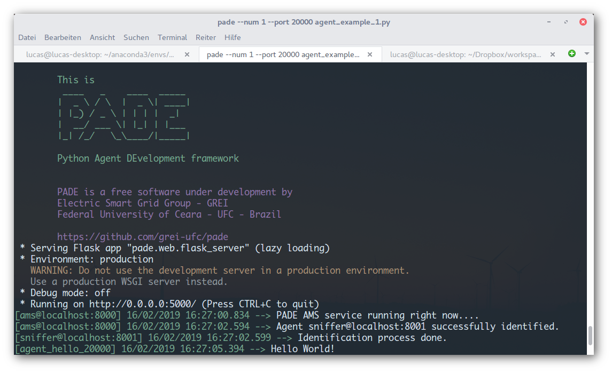

.. _hello-world-page:

Alô Mundo
---------

PADE foi implementado com um objetivo central: simplicidade!

Depois de ter o PADE instalado em seu computador fica bem simples começar a trabalhar.

Em uma pasta crie um arquivo chamado agent_example_1.py com o seu editor de texto preferido, e copie e cole o seguinte trecho de código dentro dele. Ou vá na pasta de exemplos do repositório pade no GitHub (`repositório pade <https://github.com/grei-ufc/pade>`)  e procure o arquivo agent_example_1.py que já contém o código listado abaixo:

::

    # Hello world in PADE!
    #
    # Criado por Lucas S Melo em 21 de julho de 2015 - Fortaleza, Ceará - Brasil

    from pade.misc.utility import display_message, start_loop
    from pade.core.agent import Agent
    from pade.acl.aid import AID
    from sys import argv

    class AgenteHelloWorld(Agent):
        def __init__(self, aid):
            super(AgenteHelloWorld, self).__init__(aid=aid)
            display_message(self.aid.localname, 'Hello World!')

    if __name__ == '__main__':

        agents_per_process = 3
        c = 0
        agents = list()
        for i in range(agents_per_process):
            port = int(argv[1]) + c
            agent_name = 'agent_hello_{}@localhost:{}'.format(port, port)
            agente_hello = AgenteHelloWorld(AID(name=agent_name))
            agents.append(agente_hello)
            c += 1000
        
        start_loop(agents)

Na linha de comando do terminal digite:

.. code-block:: console

    $ pade start-runtime --port 20000 agent_example_1.py

Pronto! Se tudo der certo você deve estar vendo na tela do seu terminal a splash screen do pade, parecida com esta: 

    

Este já é um agente, mas não tem muita utilidade, não é mesmo! Executa apenas uma vez :(

Então como construir um agente que tenha seu comportamento executado de tempos em tempos?
    
