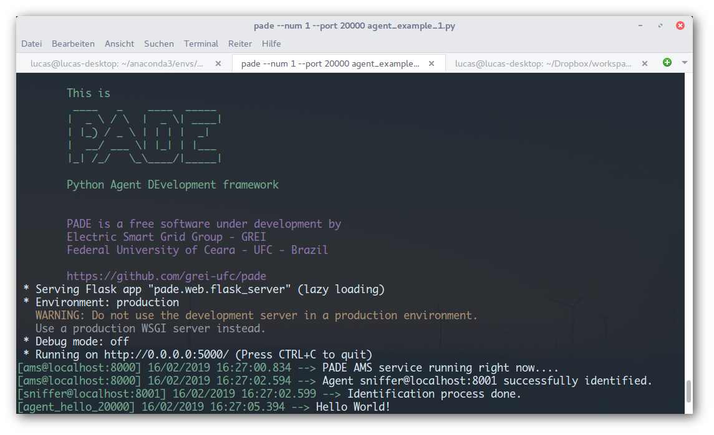

.. _hello-world-page:

Alô Mundo
---------

O primeiro passo com o PADE continua sendo simples: definir um agente,
registrá-lo no AMS e iniciar o loop de execução.

O exemplo introdutório adaptado para a versão atual está em
``pade/tests/agent_example_1/agent_example_1_updated.py``. Abaixo está
uma versão mínima do mesmo fluxo, suficiente para validar a instalação e
entender a estrutura básica do framework.

::

    from pade.misc.utility import display_message, start_loop
    from pade.misc.data_logger import get_shared_session_id, logger
    from pade.core.agent import Agent
    from pade.acl.aid import AID
    from sys import argv

    class AgenteHelloWorld(Agent):
        def __init__(self, aid, session_id):
            super().__init__(aid=aid, debug=False)
            self.session_id = session_id

        def on_start(self):
            super().on_start()
            display_message(self.aid.localname, 'Hello World!')
            logger.log_agent(
                agent_id=self.aid.name,
                session_id=self.session_id,
                name=self.aid.name,
                state='Active'
            )

    if __name__ == '__main__':
        ams_config = {'name': 'localhost', 'port': 8000}
        session_id = get_shared_session_id()

        logger.log_session(
            session_id=session_id,
            name=f"HelloWorld_{session_id}",
            state='Started'
        )

        agents = []
        base_port = int(argv[1]) if len(argv) > 1 else 20000

        for offset in (0, 1000, 2000):
            port = base_port + offset
            agent_name = f'agent_hello_{port}@localhost:{port}'
            agent = AgenteHelloWorld(AID(name=agent_name), session_id)
            agent.update_ams(ams_config)
            agents.append(agent)

        start_loop(agents)

Executando a simulação
----------------------

No terminal, execute:

.. code-block:: console

    $ pade start-runtime --port 20000 hello_world.py

Se tudo estiver correto, o PADE iniciará o AMS, o Sniffer e o seu
script. No terminal você verá a splash screen do framework e, em
seguida, as mensagens ``Hello World!`` emitidas pelos agentes.

Sobre os logs
-------------

Esse exemplo já é suficiente para gerar ``sessions.csv`` e
``agents.csv``. Se você quiser ver tráfego também em ``messages.csv``,
use o exemplo completo ``agent_example_1_updated.py``, que envia uma
mensagem real entre agentes para produzir atividade observável pelo
Sniffer.

Modo manual
-----------

O fluxo integrado com ``start-runtime`` é o recomendado, mas você ainda
pode subir os componentes separadamente quando estiver depurando a
infraestrutura:

.. code-block:: console

    $ python -m pade.core.new_ams user user@pade.com 12345 8000

.. code-block:: console

    $ python -m pade.core.sniffer 8001

.. code-block:: console

    $ python hello_world.py 20000

Esse já é um agente funcional. O passo seguinte costuma ser adicionar um
comportamento temporal ou começar a trocar mensagens ACL com outros
agentes.
