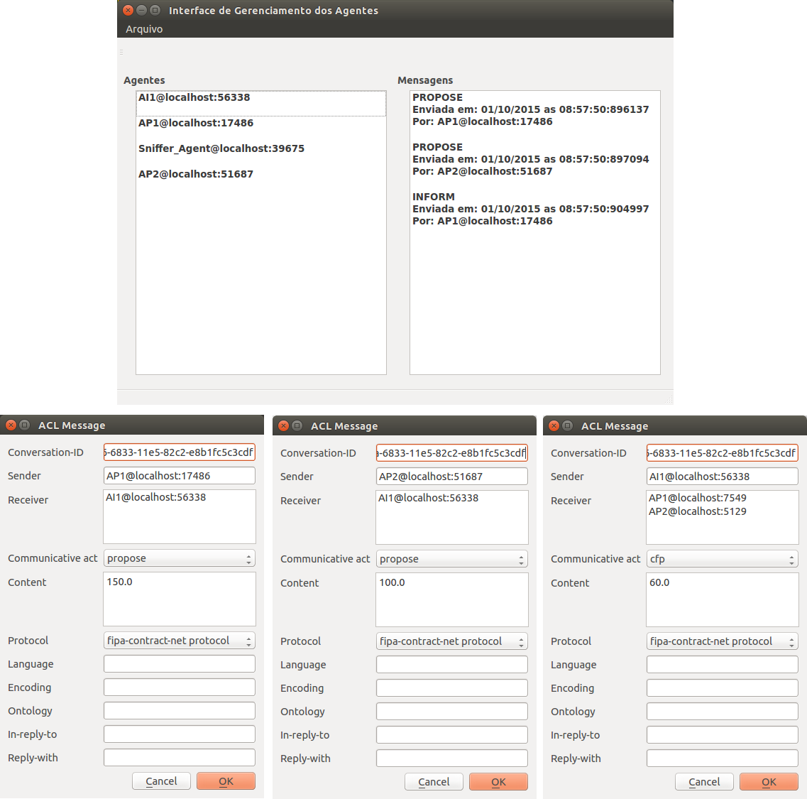
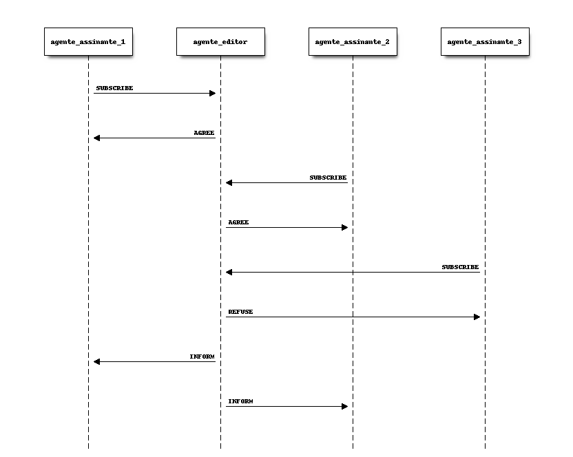

Protocolos
==========

O PADE tem suporte aos protocolos mais utilizados estabelecidos pela FIPA, são eles:

* :ref:`FIPA-Request`
* :ref:`FIPA-Contract-Net`
* :ref:`FIPA-Subscribe`

No PADE qualquer protocolo deve ser implementado como uma classe que extende a classe do protocolo desejado, por exemplo para implementar o protocolo FIPA-Request, deve ser implementada uma classe que implementa a herança da classe FipaRequestProtocol:

::

    from pade.behaviours.protocols import FipaRequestProtocol

    class ProtocoloDeRequisicao(FipaRequestProtocol):

        def __init__(self):
            super(ProtocoloDeRequisicao, self).__init__()

.. _FIPA-Request:

FIPA-Request
------------

O protocolo FIPA-Request é o mais simples de se utilizar e constitui uma padronização do ato de requisitar alguma tarefa ou informação de um agente iniciador para um agente participante.

O diagrama de comunicação do protocolo FIPA-Request está mostrado na Figura abaixo:

.. image:: ../img/seq_diag_request.png
    :align: center
    :width: 4.5in

Para exemplificar o protocolo FIPA-Request, iremos utilizar como exemplo a interação entre dois agentes, um agente relogio, que a cada um segundo exibe na tela a data e o horário atuais, mas com um problema, o agente relogio não sabe calcular nem a data, e muito menos o horário atual. Assim, ele precisa requisitar estas informações do agente horario que consegue calcular estas informações.

Dessa forma, será utilizado o protocolo FIPA-Request, para que estas informações sejam trocadas entre os dois agentes, sendo o agente relógio o iniciante, no processo de requisição e o agente horário, o participante, segue o código do exemplo, que corresponde ao arquivo exemplo agent_example_3.py:

::
    
    from pade.misc.utility import display_message, start_loop
    from pade.core.agent import Agent
    from pade.acl.messages import ACLMessage
    from pade.acl.aid import AID
    from pade.behaviours.protocols import FipaRequestProtocol
    from pade.behaviours.protocols import TimedBehaviour

    from datetime import datetime
    from sys import argv

    class CompRequest(FipaRequestProtocol):
        """FIPA Request Behaviour of the Time agent.
        """
        def __init__(self, agent):
            super(CompRequest, self).__init__(agent=agent,
                                              message=None,
                                              is_initiator=False)

        def handle_request(self, message):
            super(CompRequest, self).handle_request(message)
            display_message(self.agent.aid.localname, 'request message received')
            now = datetime.now()
            reply = message.create_reply()
            reply.set_performative(ACLMessage.INFORM)
            reply.set_content(now.strftime('%d/%m/%Y - %H:%M:%S'))
            self.agent.send(reply)

    class CompRequest2(FipaRequestProtocol):
        """FIPA Request Behaviour of the Clock agent.
        """
        def __init__(self, agent, message):
            super(CompRequest2, self).__init__(agent=agent,
                                               message=message,
                                               is_initiator=True)

        def handle_inform(self, message):
            display_message(self.agent.aid.localname, message.content)

    class ComportTemporal(TimedBehaviour):
        """Timed Behaviour of the Clock agent"""
        def __init__(self, agent, time, message):
            super(ComportTemporal, self).__init__(agent, time)
            self.message = message

        def on_time(self):
            super(ComportTemporal, self).on_time()
            self.agent.send(self.message)

    class TimeAgent(Agent):
        """Class that defines the Time agent."""
        def __init__(self, aid):
            super(TimeAgent, self).__init__(aid=aid, debug=False)

            self.comport_request = CompRequest(self)

            self.behaviours.append(self.comport_request)

    class ClockAgent(Agent):
        """Class thet defines the Clock agent."""
        def __init__(self, aid, time_agent_name):
            super(ClockAgent, self).__init__(aid=aid)

            # message that requests time of Time agent.
            message = ACLMessage(ACLMessage.REQUEST)
            message.set_protocol(ACLMessage.FIPA_REQUEST_PROTOCOL)
            message.add_receiver(AID(name=time_agent_name))
            message.set_content('time')

            self.comport_request = CompRequest2(self, message)
            self.comport_temp = ComportTemporal(self, 8.0, message)

            self.behaviours.append(self.comport_request)
            self.behaviours.append(self.comport_temp)

    if __name__ == '__main__':

        agents_per_process = 1
        c = 0
        agents = list()
        for i in range(agents_per_process):
            port = int(argv[1]) + c
            time_agent_name = 'agent_time_{}@localhost:{}'.format(port, port)
            time_agent = TimeAgent(AID(name=time_agent_name))
            agents.append(time_agent)
            
            clock_agent_name = 'agent_clock_{}@localhost:{}'.format(port - 10000, port - 10000)
            clock_agent = ClockAgent(AID(name=clock_agent_name), time_agent_name)
            agents.append(clock_agent)

            c += 500

        start_loop(agents)

Na primeira parte do código são importadas todos módulos e classes necessários à construção dos agentes, logo em seguida as classes que implementam o protocolo são definidas, as classes ComptRequest e ComptRequest2 que serão associadas aos comportamentos dos agentes horario e relogio, respectivamente. Como o agente relogio precisa, a cada segundo enviar requisição ao agente horario, então também deve ser associado a este agente um comportamento temporal, definido na classe ComportTemporal que envia uma solicitação ao agente horario, a cada segundo.

Em seguida, os agente propriamente ditos, são definidos nas classes AgenteHoraio e AgenteRelogio que estendem a classe Agent, nessas classes é que os comportamentos e protocolos são associados a cada agente.

Na ultima parte do código, é definida uma função main que indica a localização do agente ams, instancia os agentes e dá inicio ao loop de execução.

.. _FIPA-Contract-Net:

FIPA-Contract-Net
-----------------

O protocolo FIPA-Contract-Net é utilizado para situações onde é necessário realizar algum tipo de negociação entre agentes. Da mesma forma que no protocolo FIPA-Request, no protocolo FIPA-ContractNet existem dois tipos de agentes, um agente que inicia a negociação, ou agente iniciante, fazendo solicitação de propostas e um ou mais agentes que participam da negociação, ou agentes pasticipantes, que repondem às solicitações de propostas do agente iniciante. Veja:

.. figure:: ../img/seq_diag_contract.png
    :align: center
    :width: 4.5in

Um exemplo de utilização do protocolo FIPA-ContractNet na negociação é mostrado abaixo, com a solicitação de um agente iniciante por potência elétrica a outros dois agentes participantes. Este código corresponde ao arquivo exemplo agent_example_4.py:

::

    from pade.misc.utility import display_message, start_loop
    from pade.core.agent import Agent
    from pade.acl.aid import AID
    from pade.acl.messages import ACLMessage
    from pade.behaviours.protocols import FipaContractNetProtocol
    from sys import argv
    from random import uniform

    class CompContNet1(FipaContractNetProtocol):
        '''CompContNet1

           Initial FIPA-ContractNet Behaviour that sends CFP messages
           to other feeder agents asking for restoration proposals.
           This behaviour also analyzes the proposals and selects the
           one it judges to be the best.'''

        def __init__(self, agent, message):
            super(CompContNet1, self).__init__(
                agent=agent, message=message, is_initiator=True)
            self.cfp = message

        def handle_all_proposes(self, proposes):
            """
            """

            super(CompContNet1, self).handle_all_proposes(proposes)

            best_proposer = None
            higher_power = 0.0
            other_proposers = list()
            display_message(self.agent.aid.name, 'Analyzing proposals...')

            i = 1

            # logic to select proposals by the higher available power.
            for message in proposes:
                content = message.content
                power = float(content)
                display_message(self.agent.aid.name,
                                'Analyzing proposal {i}'.format(i=i))
                display_message(self.agent.aid.name,
                                'Power Offered: {pot}'.format(pot=power))
                i += 1
                if power > higher_power:
                    if best_proposer is not None:
                        other_proposers.append(best_proposer)

                    higher_power = power
                    best_proposer = message.sender
                else:
                    other_proposers.append(message.sender)

            display_message(self.agent.aid.name,
                            'The best proposal was: {pot} VA'.format(
                                pot=higher_power))

            if other_proposers != []:
                display_message(self.agent.aid.name,
                                'Sending REJECT_PROPOSAL answers...')
                answer = ACLMessage(ACLMessage.REJECT_PROPOSAL)
                answer.set_protocol(ACLMessage.FIPA_CONTRACT_NET_PROTOCOL)
                answer.set_content('')
                for agent in other_proposers:
                    answer.add_receiver(agent)

                self.agent.send(answer)

            if best_proposer is not None:
                display_message(self.agent.aid.name,
                                'Sending ACCEPT_PROPOSAL answer...')

                answer = ACLMessage(ACLMessage.ACCEPT_PROPOSAL)
                answer.set_protocol(ACLMessage.FIPA_CONTRACT_NET_PROTOCOL)
                answer.set_content('OK')
                answer.add_receiver(best_proposer)
                self.agent.send(answer)

        def handle_inform(self, message):
            """
            """
            super(CompContNet1, self).handle_inform(message)

            display_message(self.agent.aid.name, 'INFORM message received')

        def handle_refuse(self, message):
            """
            """
            super(CompContNet1, self).handle_refuse(message)

            display_message(self.agent.aid.name, 'REFUSE message received')

        def handle_propose(self, message):
            """
            """
            super(CompContNet1, self).handle_propose(message)

            display_message(self.agent.aid.name, 'PROPOSE message received')

    class CompContNet2(FipaContractNetProtocol):
        '''CompContNet2

           FIPA-ContractNet Participant Behaviour that runs when an agent
           receives a CFP message. A proposal is sent and if it is selected,
           the restrictions are analized to enable the restoration.'''

        def __init__(self, agent):
            super(CompContNet2, self).__init__(agent=agent,
                                               message=None,
                                               is_initiator=False)

        def handle_cfp(self, message):
            """
            """
            self.agent.call_later(1.0, self._handle_cfp, message)

        def _handle_cfp(self, message):
            """
            """
            super(CompContNet2, self).handle_cfp(message)
            self.message = message

            display_message(self.agent.aid.name, 'CFP message received')

            answer = self.message.create_reply()
            answer.set_performative(ACLMessage.PROPOSE)
            answer.set_content(str(self.agent.pot_disp))
            self.agent.send(answer)

        def handle_reject_propose(self, message):
            """
            """
            super(CompContNet2, self).handle_reject_propose(message)

            display_message(self.agent.aid.name,
                            'REJECT_PROPOSAL message received')

        def handle_accept_propose(self, message):
            """
            """
            super(CompContNet2, self).handle_accept_propose(message)

            display_message(self.agent.aid.name,
                            'ACCEPT_PROPOSE message received')

            answer = message.create_reply()
            answer.set_performative(ACLMessage.INFORM)
            answer.set_content('OK')
            self.agent.send(answer)

    class AgentInitiator(Agent):

        def __init__(self, aid, participants):
            super(AgentInitiator, self).__init__(aid=aid, debug=False)

            message = ACLMessage(ACLMessage.CFP)
            message.set_protocol(ACLMessage.FIPA_CONTRACT_NET_PROTOCOL)
            message.set_content('60.0')

            for participant in participants:
                message.add_receiver(AID(name=participant))

            self.call_later(8.0, self.launch_contract_net_protocol, message)

        def launch_contract_net_protocol(self, message):
            comp = CompContNet1(self, message)
            self.behaviours.append(comp)
            comp.on_start()

    class AgentParticipant(Agent):

        def __init__(self, aid, pot_disp):
            super(AgentParticipant, self).__init__(aid=aid, debug=False)

            self.pot_disp = pot_disp

            comp = CompContNet2(self)

            self.behaviours.append(comp)

    if __name__ == "__main__":
        agents_per_process = 2
        c = 0
        agents = list()
        for i in range(agents_per_process):
            port = int(argv[1]) + c        
            k = 10000
            participants = list()

            agent_name = 'agent_participant_{}@localhost:{}'.format(port - k, port - k)
            participants.append(agent_name)
            agente_part_1 = AgentParticipant(AID(name=agent_name), uniform(100.0, 500.0))
            agents.append(agente_part_1)

            agent_name = 'agent_participant_{}@localhost:{}'.format(port + k, port + k)
            participants.append(agent_name)
            agente_part_2 = AgentParticipant(AID(name=agent_name), uniform(100.0, 500.0))
            agents.append(agente_part_2)

            agent_name = 'agent_initiator_{}@localhost:{}'.format(port, port)
            agente_init_1 = AgentInitiator(AID(name=agent_name), participants)
            agents.append(agente_init_1)

            c += 1000
        
        start_loop(agents)

O código que implementa os agentes que se comunicam utilizando o protocolo FIPA-ContractNet, definine as duas classes do protocolo, a primeira implementa o comportamento do agente Iniciante (CompContNet1) e a segunda implementa o comportamento do agente participante (CompContNet2). Note que para a classe iniciante é necessário que uma mensagem do tipo CFP (call for proposes) seja montada e o método on_start() seja chamado, isso é feito dentro da classe que implementa os agente iniciante, AgenteIniciante(), já a classe AgenteParticipante(), implementa os agentes que participarão da negociação como propositores.

É possível observar as mensagens da negociação na intergace gráfica do PADE, veja:

.. _FIPA-Subscribe:

FIPA-Subscribe
--------------

O protocolo FIPA-Subscribe, implementa o comportamento de editor-assinante, que conssiste na presença de um agente editor que pode aceitar a associação de outros agentes interessados, agentes assinantes, em algum tipo de informação que este agente possua, assinando a informação e recebendo mensagem sempre que esta informação for disponibilizada pelo agente editor. Veja:

Para assinar a informação o agente precisa enviar uma mensagem SUSBCRIBE para o agente editor. Que por sua vez pode aceitar ou recusar a assinatura (AGREE/REFUSE). Quando uma informação é atualizada, então o editor publica esta informação para todos os seus assinantes, enviando-os mensagens INFORM.

O código que implementa um agente editor e dois agentes assinantes utilizando PADE pode ser visualizado abaixo e corresponde ao arquivo exemplo agent_example_5.py:

::

    from pade.misc.utility import display_message, start_loop
    from pade.core.agent import Agent
    from pade.acl.aid import AID
    from pade.acl.messages import ACLMessage
    from pade.behaviours.protocols import FipaSubscribeProtocol, TimedBehaviour
    from sys import argv
    import random

    class SubscriberProtocol(FipaSubscribeProtocol):

        def __init__(self, agent, message):
            super(SubscriberProtocol, self).__init__(agent,
                                                     message,
                                                     is_initiator=True)

        def handle_agree(self, message):
            display_message(self.agent.aid.name, message.content)

        def handle_inform(self, message):
            display_message(self.agent.aid.name, message.content)

    class PublisherProtocol(FipaSubscribeProtocol):

        def __init__(self, agent):
            super(PublisherProtocol, self).__init__(agent,
                                                       message=None,
                                                       is_initiator=False)

        def handle_subscribe(self, message):
            self.register(message.sender)
            display_message(self.agent.aid.name, message.content)
            resposta = message.create_reply()
            resposta.set_performative(ACLMessage.AGREE)
            resposta.set_content('Subscribe message accepted')
            self.agent.send(resposta)

        def handle_cancel(self, message):
            self.deregister(self, message.sender)
            display_message(self.agent.aid.name, message.content)

        def notify(self, message):
            super(PublisherProtocol, self).notify(message)

    class Time(TimedBehaviour):

        def __init__(self, agent, notify):
            super(Time, self).__init__(agent, 1)
            self.notify = notify
            self.inc = 0

        def on_time(self):
            super(Time, self).on_time()
            message = ACLMessage(ACLMessage.INFORM)
            message.set_protocol(ACLMessage.FIPA_SUBSCRIBE_PROTOCOL)
            message.set_content(str(random.random()))
            self.notify(message)
            self.inc += 0.1

    class AgentSubscriber(Agent):

        def __init__(self, aid, message):
            super(AgentSubscriber, self).__init__(aid)

            self.call_later(8.0, self.launch_subscriber_protocol, message)

        def launch_subscriber_protocol(self, message):
            self.protocol = SubscriberProtocol(self, message)
            self.behaviours.append(self.protocol)
            self.protocol.on_start()

    class AgentPublisher(Agent):

        def __init__(self, aid):
            super(AgentPublisher, self).__init__(aid)

            self.protocol = PublisherProtocol(self)
            self.timed = Time(self, self.protocol.notify)

            self.behaviours.append(self.protocol)
            self.behaviours.append(self.timed)

    if __name__ == '__main__':

        agents_per_process = 2
        c = 0
        agents = list()
        for i in range(agents_per_process):
            port = int(argv[1]) + c        
            k = 10000
            participants = list()

            agent_name = 'agent_publisher_{}@localhost:{}'.format(port, port)
            participants.append(agent_name)
            agent_pub_1 = AgentPublisher(AID(name=agent_name))
            agents.append(agent_pub_1)

            msg = ACLMessage(ACLMessage.SUBSCRIBE)
            msg.set_protocol(ACLMessage.FIPA_SUBSCRIBE_PROTOCOL)
            msg.set_content('Subscription request')
            msg.add_receiver(agent_pub_1.aid)

            agent_name = 'agent_subscriber_{}@localhost:{}'.format(port + k, port + k)
            participants.append(agent_name)
            agent_sub_1 = AgentSubscriber(AID(name=agent_name), msg)
            agents.append(agent_sub_1)

            agent_name = 'agent_subscriber_{}@localhost:{}'.format(port - k, port - k)
            agent_sub_2 = AgentSubscriber(AID(name=agent_name), msg)
            agents.append(agent_sub_2)

            c += 1000

        start_loop(agents)

