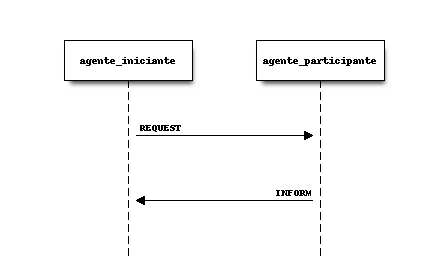
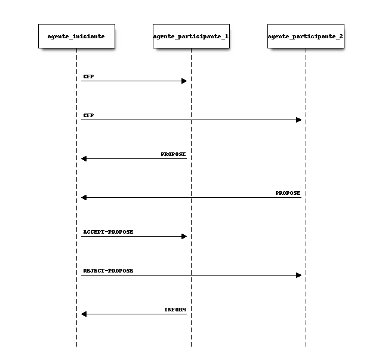
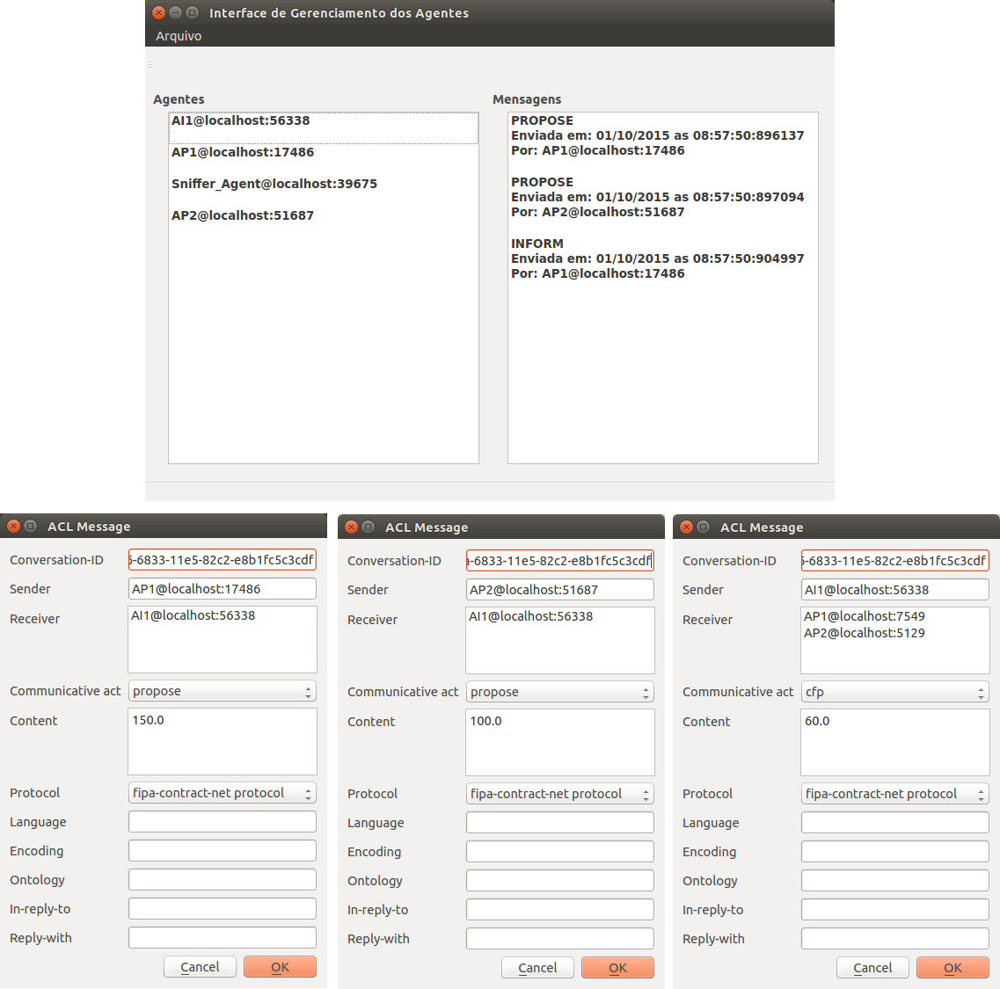
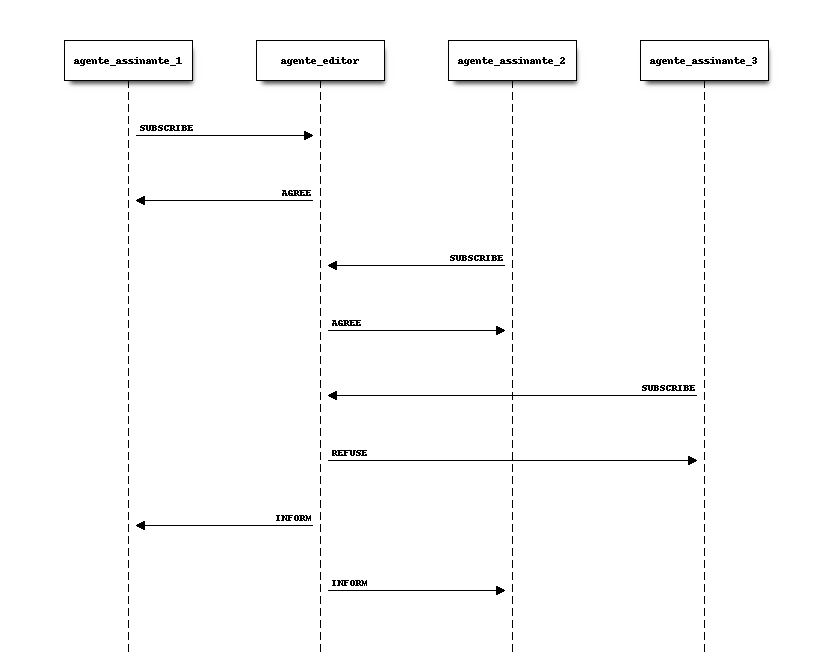

Protocolos
==========

O PADE tem suporte aos protocolos mais utilizados estabelecidos pela
FIPA. Os exemplos adaptados nesta documentação cobrem:

* :ref:`FIPA-Request`
* :ref:`FIPA-Contract-Net`
* :ref:`FIPA-Subscribe`

No PADE, qualquer protocolo deve ser implementado como uma classe que
estende a classe do protocolo desejado. Por exemplo:

::

    from pade.behaviours.protocols import FipaRequestProtocol

    class ProtocoloDeRequisicao(FipaRequestProtocol):
        def __init__(self, agent, message):
            super().__init__(agent=agent, message=message, is_initiator=True)

Os exemplos modernos continuam usando ``update_ams()``,
``start_loop(agents)`` e ``get_shared_session_id()`` para manter a
execução alinhada ao runtime integrado do PADE atual.

.. _FIPA-Request:

FIPA-Request
------------

O protocolo FIPA-Request padroniza o ato de requisitar alguma tarefa ou
informação de um agente iniciador para um agente participante.

O diagrama de comunicação do protocolo FIPA-Request está mostrado
abaixo:

O exemplo correspondente no repositório é
``pade/tests/agent_example_3/agent_example_3_updated.py``. Ele modela
um agente relógio que requisita a hora atual a um agente servidor.

::

    from pade.misc.utility import display_message, start_loop
    from pade.core.agent import Agent
    from pade.acl.messages import ACLMessage
    from pade.acl.aid import AID
    from pade.behaviours.protocols import FipaRequestProtocol, TimedBehaviour
    from pade.misc.data_logger import get_shared_session_id, logger
    from datetime import datetime
    from sys import argv

    class CompRequest(FipaRequestProtocol):
        def __init__(self, agent):
            super().__init__(agent=agent, message=None, is_initiator=False)

        def handle_request(self, message):
            super().handle_request(message)
            display_message(self.agent.aid.localname, 'request message received')

            now = datetime.now()
            reply = message.create_reply()
            reply.set_performative(ACLMessage.INFORM)
            reply.set_content(now.strftime('%d/%m/%Y - %H:%M:%S'))
            self.agent.send(reply)

    class CompRequest2(FipaRequestProtocol):
        def __init__(self, agent, message):
            super().__init__(agent=agent, message=message, is_initiator=True)

        def handle_inform(self, message):
            display_message(self.agent.aid.localname, message.content)

    class ComportTemporal(TimedBehaviour):
        def __init__(self, agent, time, message):
            super().__init__(agent, time)
            self.message = message

        def on_time(self):
            super().on_time()
            self.agent.send(self.message)

    class TimeAgent(Agent):
        def __init__(self, aid):
            super().__init__(aid=aid, debug=False)
            self.behaviours.append(CompRequest(self))

    class ClockAgent(Agent):
        def __init__(self, aid, time_agent_name):
            super().__init__(aid=aid, debug=False)

            message = ACLMessage(ACLMessage.REQUEST)
            message.set_protocol(ACLMessage.FIPA_REQUEST_PROTOCOL)
            message.add_receiver(AID(name=time_agent_name))
            message.set_content('time')

            self.behaviours.append(CompRequest2(self, message))
            self.behaviours.append(ComportTemporal(self, 8.0, message))

    if __name__ == '__main__':
        ams_config = {'name': 'localhost', 'port': 8000}
        session_id = get_shared_session_id()

        logger.log_session(
            session_id=session_id,
            name=f"FIPA_Request_{session_id}",
            state='Started'
        )

        agents = []
        base_port = int(argv[1]) if len(argv) > 1 else 20000

        time_name = f'agent_time_{base_port}@localhost:{base_port}'
        time_agent = TimeAgent(AID(name=time_name))
        time_agent.update_ams(ams_config)
        agents.append(time_agent)

        clock_port = base_port + 1
        clock_name = f'agent_clock_{clock_port}@localhost:{clock_port}'
        clock_agent = ClockAgent(AID(name=clock_name), time_name)
        clock_agent.update_ams(ams_config)
        agents.append(clock_agent)

        start_loop(agents)

Na prática:

* o agente participante implementa ``handle_request()``;
* o agente iniciador implementa ``handle_inform()``;
* a mensagem inicial deve ter performative ``REQUEST`` e protocolo
  ``ACLMessage.FIPA_REQUEST_PROTOCOL``.

.. _FIPA-Contract-Net:

FIPA-Contract-Net
-----------------

O protocolo FIPA-Contract-Net é utilizado em situações de negociação.
Existe um agente iniciador, que solicita propostas, e um ou mais
agentes participantes, que respondem com ofertas.

O exemplo adaptado no repositório é
``pade/tests/agent_example_4/agent_example_4_updated.py``. Nele, um
agente iniciador solicita propostas de potência elétrica a dois agentes
participantes e escolhe a melhor oferta.

::

    from pade.misc.utility import display_message, start_loop
    from pade.core.agent import Agent
    from pade.acl.aid import AID
    from pade.acl.messages import ACLMessage
    from pade.behaviours.protocols import FipaContractNetProtocol
    from pade.misc.data_logger import get_shared_session_id, logger
    from random import uniform
    from sys import argv

    class CompContNet1(FipaContractNetProtocol):
        def __init__(self, agent, message):
            super().__init__(agent=agent, message=message, is_initiator=True)

        def handle_all_proposes(self, proposes):
            super().handle_all_proposes(proposes)

            best_proposer = None
            higher_power = 0.0
            other_proposers = []

            display_message(self.agent.aid.name, 'Analyzing proposals...')

            for message in proposes:
                power = float(message.content)
                display_message(self.agent.aid.name, f'Power Offered: {power}')

                if power > higher_power:
                    if best_proposer is not None:
                        other_proposers.append(best_proposer)
                    higher_power = power
                    best_proposer = message.sender
                else:
                    other_proposers.append(message.sender)

            if other_proposers:
                answer = ACLMessage(ACLMessage.REJECT_PROPOSAL)
                answer.set_protocol(ACLMessage.FIPA_CONTRACT_NET_PROTOCOL)
                answer.set_content('Proposal rejected')
                for agent in other_proposers:
                    answer.add_receiver(agent)
                self.agent.send(answer)

            if best_proposer is not None:
                answer = ACLMessage(ACLMessage.ACCEPT_PROPOSAL)
                answer.set_protocol(ACLMessage.FIPA_CONTRACT_NET_PROTOCOL)
                answer.set_content('OK')
                answer.add_receiver(best_proposer)
                self.agent.send(answer)

        def handle_inform(self, message):
            super().handle_inform(message)
            display_message(self.agent.aid.name, 'INFORM message received')

    class CompContNet2(FipaContractNetProtocol):
        def __init__(self, agent):
            super().__init__(agent=agent, message=None, is_initiator=False)

        def handle_cfp(self, message):
            self.agent.call_later(1.0, self._handle_cfp, message)

        def _handle_cfp(self, message):
            super().handle_cfp(message)

            display_message(self.agent.aid.name, 'CFP message received')

            answer = message.create_reply()
            answer.set_performative(ACLMessage.PROPOSE)
            answer.set_content(str(self.agent.pot_disp))
            self.agent.send(answer)

        def handle_reject_propose(self, message):
            super().handle_reject_propose(message)
            display_message(self.agent.aid.name, 'REJECT_PROPOSAL message received')

        def handle_accept_propose(self, message):
            super().handle_accept_propose(message)
            display_message(self.agent.aid.name, 'ACCEPT_PROPOSE message received')

            answer = message.create_reply()
            answer.set_performative(ACLMessage.INFORM)
            answer.set_content('OK')
            self.agent.send(answer)

    class AgentInitiator(Agent):
        def __init__(self, aid, participants):
            super().__init__(aid=aid, debug=False)

            message = ACLMessage(ACLMessage.CFP)
            message.set_protocol(ACLMessage.FIPA_CONTRACT_NET_PROTOCOL)
            message.set_content('60.0')

            for participant in participants:
                message.add_receiver(AID(name=participant))

            self.call_later(8.0, self.launch_contract_net_protocol, message)

        def launch_contract_net_protocol(self, message):
            comp = CompContNet1(self, message)
            self.behaviours.append(comp)
            comp.on_start()

    class AgentParticipant(Agent):
        def __init__(self, aid, pot_disp):
            super().__init__(aid=aid, debug=False)
            self.pot_disp = pot_disp
            self.behaviours.append(CompContNet2(self))

    if __name__ == '__main__':
        ams_config = {'name': 'localhost', 'port': 8000}
        session_id = get_shared_session_id()

        logger.log_session(
            session_id=session_id,
            name=f"ContractNet_{session_id}",
            state='Started'
        )

        agents = []
        base_port = int(argv[1]) if len(argv) > 1 else 20000
        participants = []

        for participant_port in (base_port - 10000, base_port + 10000):
            name = f'agent_participant_{participant_port}@localhost:{participant_port}'
            participants.append(name)
            agent = AgentParticipant(AID(name=name), uniform(100.0, 500.0))
            agent.update_ams(ams_config)
            agents.append(agent)

        initiator_name = f'agent_initiator_{base_port}@localhost:{base_port}'
        initiator = AgentInitiator(AID(name=initiator_name), participants)
        initiator.update_ams(ams_config)
        agents.append(initiator)

        start_loop(agents)

Nesse protocolo:

* o iniciador monta uma mensagem ``CFP``;
* os participantes respondem com ``PROPOSE``;
* o iniciador envia ``ACCEPT_PROPOSAL`` para o vencedor e
  ``REJECT_PROPOSAL`` para os demais;
* o vencedor confirma com ``INFORM``.

.. _FIPA-Subscribe:

FIPA-Subscribe
--------------

O protocolo FIPA-Subscribe implementa o paradigma editor-assinante.
Existe um agente editor, que aceita ou recusa assinaturas, e um ou mais
agentes assinantes, que passam a receber publicações sempre que a
informação muda.

O exemplo correspondente é
``pade/tests/agent_example_5/agent_example_5_updated.py``. Nele, um
agente publicador gera números aleatórios e dois agentes assinantes
recebem essas publicações.

::

    from pade.misc.utility import display_message, start_loop
    from pade.core.agent import Agent
    from pade.acl.aid import AID
    from pade.acl.messages import ACLMessage
    from pade.behaviours.protocols import FipaSubscribeProtocol, TimedBehaviour
    from pade.misc.data_logger import get_shared_session_id, logger
    from sys import argv
    import random

    class SubscriberProtocol(FipaSubscribeProtocol):
        def __init__(self, agent, message):
            super().__init__(agent, message, is_initiator=True)

        def handle_agree(self, message):
            display_message(self.agent.aid.name, message.content)

        def handle_inform(self, message):
            display_message(self.agent.aid.name, message.content)

    class PublisherProtocol(FipaSubscribeProtocol):
        def __init__(self, agent):
            super().__init__(agent, message=None, is_initiator=False)

        def handle_subscribe(self, message):
            self.register(message.sender)
            display_message(
                self.agent.aid.name,
                f'{message.content} from {message.sender.name}'
            )

            reply = message.create_reply()
            reply.set_performative(ACLMessage.AGREE)
            reply.set_content('Subscribe message accepted')
            self.agent.send(reply)

        def handle_cancel(self, message):
            self.deregister(message.sender)
            display_message(self.agent.aid.name, message.content)

        def notify(self, message):
            super().notify(message)

    class Time(TimedBehaviour):
        def __init__(self, agent, notify_callback):
            super().__init__(agent, 1)
            self.notify_callback = notify_callback

        def on_time(self):
            super().on_time()
            message = ACLMessage(ACLMessage.INFORM)
            message.set_protocol(ACLMessage.FIPA_SUBSCRIBE_PROTOCOL)
            message.set_content(str(random.random()))
            self.notify_callback(message)

    class AgentSubscriber(Agent):
        def __init__(self, aid, publisher_aid):
            super().__init__(aid=aid, debug=False)
            self.publisher_aid = publisher_aid
            self.call_later(8.0, self.launch_subscriber_protocol)

        def launch_subscriber_protocol(self):
            msg = ACLMessage(ACLMessage.SUBSCRIBE)
            msg.set_protocol(ACLMessage.FIPA_SUBSCRIBE_PROTOCOL)
            msg.set_content('Subscription request')
            msg.add_receiver(self.publisher_aid)

            self.protocol = SubscriberProtocol(self, msg)
            self.behaviours.append(self.protocol)
            self.protocol.on_start()

    class AgentPublisher(Agent):
        def __init__(self, aid):
            super().__init__(aid=aid, debug=False)
            self.protocol = PublisherProtocol(self)
            self.timed = Time(self, self.protocol.notify)

            self.behaviours.append(self.protocol)
            self.behaviours.append(self.timed)

    if __name__ == '__main__':
        ams_config = {'name': 'localhost', 'port': 8000}
        session_id = get_shared_session_id()

        logger.log_session(
            session_id=session_id,
            name=f"Subscribe_{session_id}",
            state='Started'
        )

        agents = []
        base_port = int(argv[1]) if len(argv) > 1 else 20000
        offset = 10000

        publisher_name = f'agent_publisher_{base_port}@localhost:{base_port}'
        publisher_aid = AID(name=publisher_name)
        publisher = AgentPublisher(publisher_aid)
        publisher.update_ams(ams_config)
        agents.append(publisher)

        sub1_name = f'agent_subscriber_{base_port + offset}@localhost:{base_port + offset}'
        sub1 = AgentSubscriber(AID(name=sub1_name), publisher_aid)
        sub1.update_ams(ams_config)
        agents.append(sub1)

        sub2_name = f'agent_subscriber_{base_port - offset}@localhost:{base_port - offset}'
        sub2 = AgentSubscriber(AID(name=sub2_name), publisher_aid)
        sub2.update_ams(ams_config)
        agents.append(sub2)

        start_loop(agents)

O fluxo básico é:

* o assinante envia ``SUBSCRIBE``;
* o publicador responde com ``AGREE`` ou ``REFUSE``;
* cada nova atualização é enviada ao conjunto de assinantes com
  ``INFORM``.

FIPA-Subscribe com ``call_in_thread()``
~~~~~~~~~~~~~~~~~~~~~~~~~~~~~~~~~~~~~~~

O arquivo ``pade/tests/agent_example_6/agent_example_6_updated.py``
parte exatamente do cenário de ``FIPA-Subscribe`` e adiciona uma rotina
bloqueante executada em paralelo usando ``call_in_thread()``.

Esse padrão é útil quando o agente precisa executar uma operação longa
sem congelar o reactor do Twisted.

::

    import time
    from pade.misc.utility import call_in_thread

    def my_time(a, b):
        print('------> I will sleep now!', a)
        time.sleep(10)
        print('------> I wake up now!', b)

    class AgentPublisher(Agent):
        def __init__(self, aid):
            super().__init__(aid=aid, debug=False)
            # Inicializa o protocolo normalmente.
            # ...

            # Executa a função bloqueante em outra thread.
            call_in_thread(my_time, 'a', 'b')

Esse exemplo mostra duas ideias importantes:

* ``TimedBehaviour`` continua publicando dados em intervalos regulares;
* a função bloqueante executada em thread não interrompe o fluxo das
  mensagens ACL.
